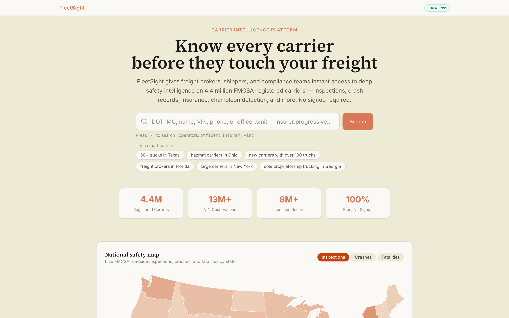
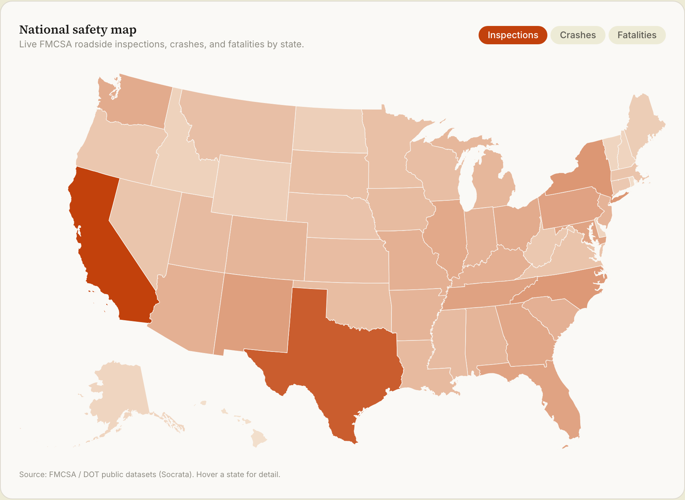
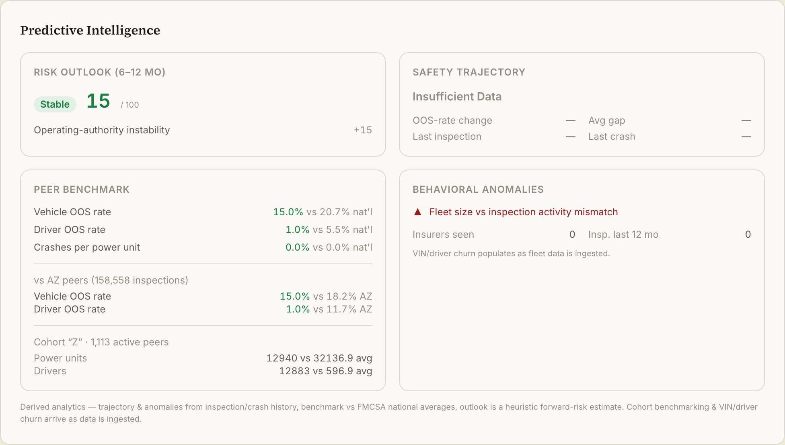

# FleetSight

[](https://github.com/lazizbekravshanov/fleetsight/actions/workflows/ci.yml)


> Know every carrier before they touch your freight.

FleetSight turns public FMCSA, DOT, and NHTSA data into a single carrier-intelligence
layer. Search any of 4.4M registered carriers and get the full picture — safety,
inspections, crashes, insurance, fraud signals, and predictive risk — on one page.
No signup.

**Live → [fleetsight.vercel.app](https://fleetsight.vercel.app)**







## What it does

- **Universal search** — by name, USDOT, MC, VIN, phone, officer, address, or insurer, plus natural-language queries
- **Carrier intelligence page** — FMCSA SAFER + SMS parity: BASIC scores, inspections, crashes, insurance, authority history, and fleet
- **Predictive intelligence** — safety trajectory, behavioral anomalies, peer + state-cohort benchmarking, and a 0–100 risk outlook
- **Fraud detection** — chameleon-carrier scoring, enabler-network mapping, and a Union-Find identity graph over shared identifiers
- **Trust Score** — composite 0–100 across safety, compliance, fraud, and stability from 25+ automated signals
- **Teams & monitoring** — shared, role-based watchlists and daily authority/alert crons
- **National safety map** — interactive choropleth of FMCSA inspections, crashes, and fatalities by state, on the landing page

## Tech

Next.js 14 · TypeScript · Tailwind · Prisma + PostgreSQL (Neon) · D3 · NextAuth ·
Upstash Redis · Anthropic Claude · Sentry · Vercel
Data sources: FMCSA QCMobile, Socrata Open Data, NHTSA.

## Run locally

```bash
cd landing
npm install --legacy-peer-deps
cp .env.example .env.local   # set DATABASE_URL (Postgres) + API keys
npx prisma generate
npm run dev
```

## License

[MIT](./LICENSE)
