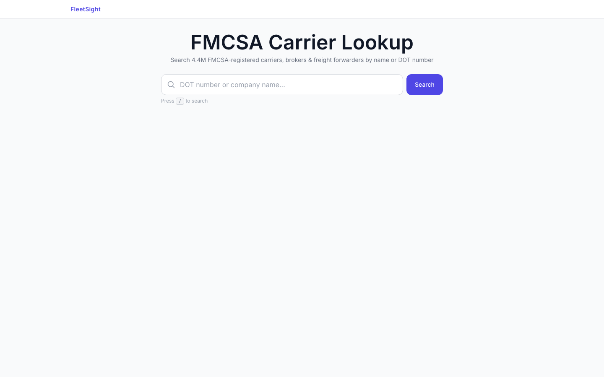
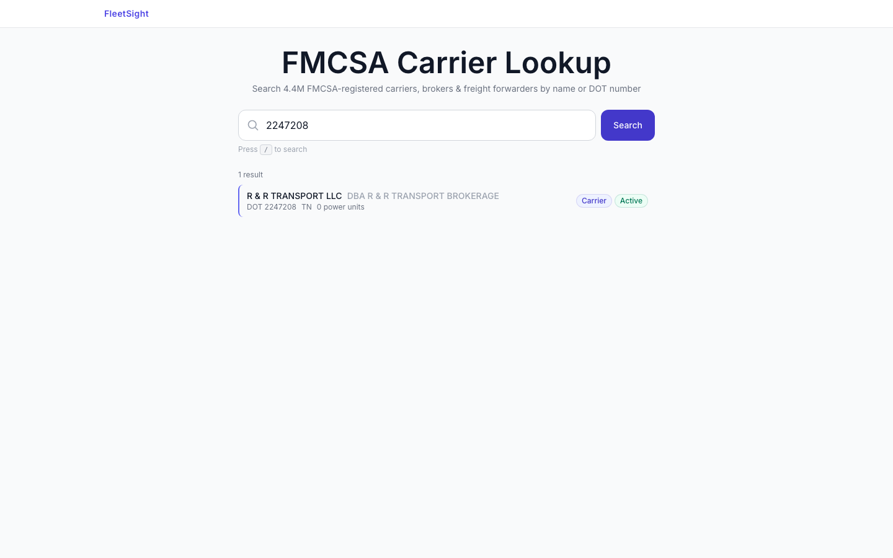

# FleetSight


FMCSA carrier lookup and compliance intelligence platform. Search 4.4M registered carriers, view inspection history, crash records, BASIC safety scores, insurance filings, fleet details, and chameleon carrier detection — all from public datasets.

**Live:** [landing-delta-dun.vercel.app](https://landing-delta-dun.vercel.app)





## Features

- **Carrier Search** — Look up any FMCSA-registered carrier by USDOT number or company name
- **7-Tab Detail View** — Overview, Safety, Inspections, Crashes, Insurance, Fleet, Detection
- **BASIC Safety Scores** — Percentile bars with 75th-percentile intervention threshold markers
- **Risk Summary Card** — Composite risk assessment from BASICs, OOS rates, crash severity, authority status
- **Inspection & Crash Filtering** — Client-side filters by state, severity, level, violations, OOS
- **Insurance & Authority History** — BIPD compliance checking, authority timeline with revocation tracking
- **Fleet & Recalls** — NHTSA vehicle decoding, recall alerts, complaint alerts (crash/fire flagged)
- **Chameleon Detection** — Shared address, phone, officer, VIN, and prior-revocation signal analysis
- **Lazy-Loaded Tabs** — Lightweight initial payload, data fetched per-tab on demand
- **CSV Export** — Download inspections, crashes, and insurance data
- **Command Palette** — Cmd+K quick navigation
- **Dashboard** — Carrier snapshot with BASIC mini-bars, OpenClaw token generation with copy-to-clipboard
- **Trust Score Engine** — Composite 0-100 score across Safety, Compliance, Fraud/Identity, and Stability dimensions, driven by 25 automated risk signals
- **D3 Crash Severity Map** — Choropleth visualization of state-level crash and OOS rates rendered from FMCSA public data
- **Enabler Network Intelligence** — Maps shared insurance policies, addresses, phone numbers, and officers across carriers to surface double-brokering and authority-mill patterns
- **Shared Watchlists** — Team-scoped carrier watchlists and notes with role-based access (admin / member / viewer)
- **Union-Find Identity Graph** — Freight-party clustering over shared identifiers to collapse chameleon fleets into a single entity
- **Daily Monitoring Crons** — Authority status change alerts, weekly compliance digest emails, and nightly violation ingestion from MCMIS

## Tech Stack

- **Framework:** Next.js 14 (App Router)
- **Language:** TypeScript
- **Styling:** Tailwind CSS
- **Auth:** NextAuth.js with credentials provider
- **Database:** Prisma + PostgreSQL
- **Animation:** Framer Motion
- **APIs:** FMCSA QCMobile, Socrata Open Data, NHTSA Vehicle API
- **Visualization:** D3.js (choropleth maps, charts), Leaflet (geographic overlays)
- **Caching & Rate Limiting:** Upstash Redis + `@upstash/ratelimit`
- **AI Enrichment:** Anthropic Claude (search translation, anomaly narration, risk narratives)
- **Observability:** Sentry
- **Deployment:** Vercel

## Getting Started

```bash
cd landing
npm install
cp .env.example .env.local  # add your API keys
npx prisma generate
npm run dev
```

## Project Structure

```
landing/
  app/
    api/carrier/[dotNumber]/   # Carrier detail + lazy-load routes
    api/chameleon/             # Detection signal API
    api/fmcsa/                 # FMCSA proxy routes
    dashboard/                 # Authenticated dashboard
  components/
    carrier/                   # Carrier detail tabs & shared utilities
    dashboard/                 # Command palette
  lib/
    socrata.ts                 # Socrata Open Data client
    nhtsa.ts                   # NHTSA complaints & recalls
    fmcsa-codes.ts             # FMCSA code decoders
```

## License

Released under the [MIT License](./LICENSE).
